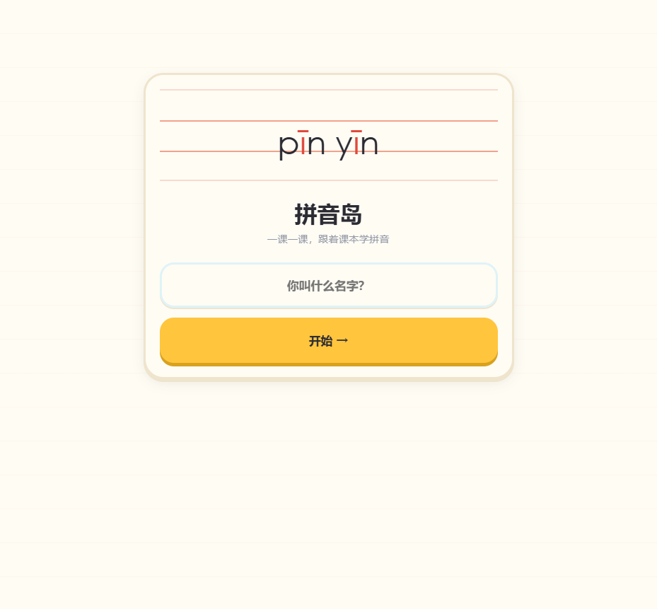
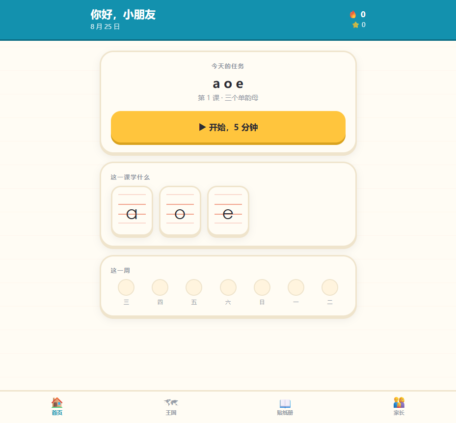
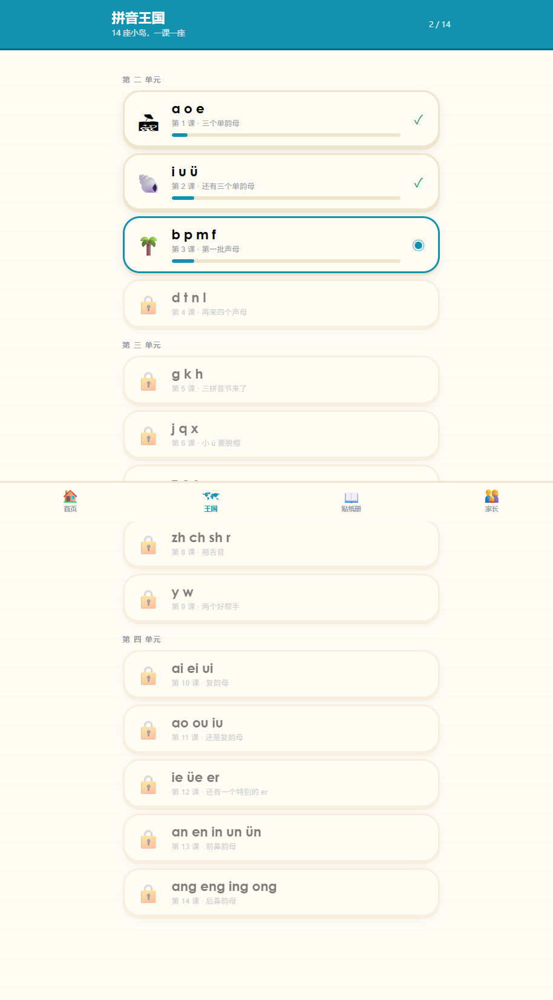
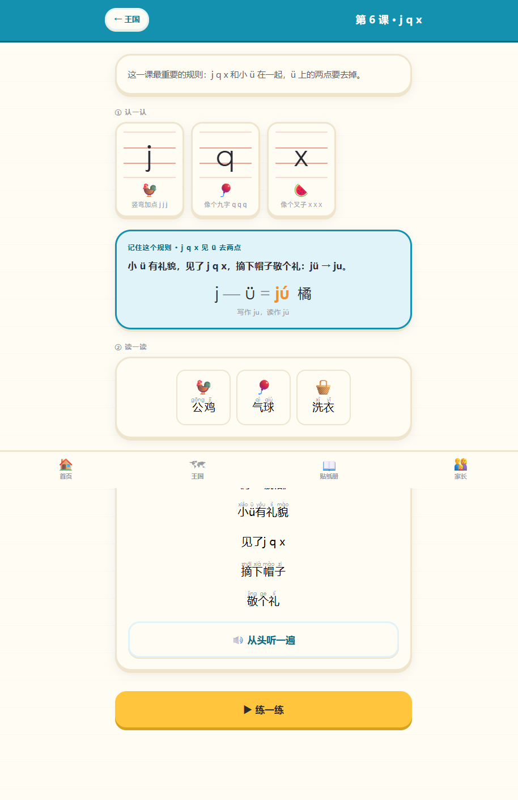
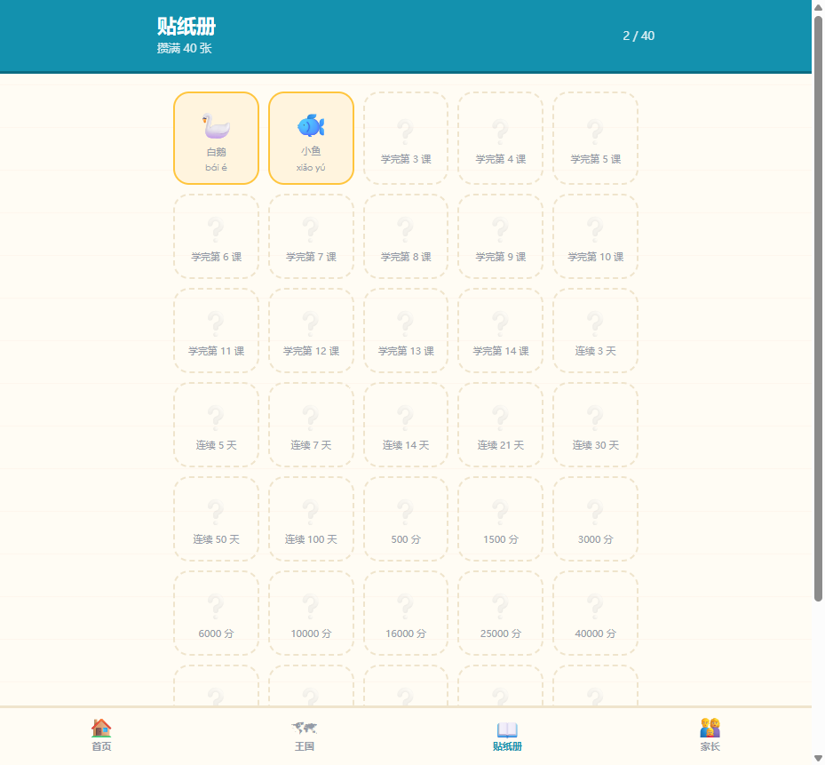

# 拼音岛 · PinyinFun

A browser app that teaches 汉语拼音 to a 7-year-old, following the lesson order of
the **2024 秋 人教版（统编版）一年级上册语文** textbook.

One child plus a parent dashboard. No accounts, no backend, no build step — open
`index.html` on an iPad and go. Add it to the home screen and it works offline.



## What it does

A five-minute 任务 each day, mixing the current lesson with spaced-repetition
review, then 14 lessons to work through and 40 stickers to collect.

Answer 9 of 10 and the lesson is cleared — the next one opens the following
morning. One lesson a day, in the order her class takes them.

| | |
|---|---|
|  |  |
| **今天的任务** — five minutes, ten questions | **拼音王国** — 14 islands, one per lesson |
|  |  |
| Every lesson: 认一认 → the rule → 读一读 → 唱一唱 | 40 stickers, each earned by doing the work |

### The four games

- **拼一拼** — hear a syllable, build it from a 声母 and a 韵母 (three slots for
  三拼音节). This is 拼读, the skill the whole pinyin unit exists to teach.
- **听音选一选** — hear a sound, tap the letter.
- **声调小火车** — hear a syllable, pick its tone. Each carriage draws the tone's
  real contour, so shape and colour say the same thing twice.
- **火眼金睛** — a timed grid: find every `b` among the `d`s, `p`s and `q`s.

## Design notes

The signature is **四线三格** — the four-line stave every Chinese first-grader
writes pinyin in. Letters stand on it the way notes stand on a staff, with
ascenders reaching the top space and descenders dropping into the bottom.

Colour carries meaning rather than decoration: the four tone colours
(1声 red · 2声 amber · 3声 green · 4声 blue) are reserved exclusively for tones,
so amber always means second tone. Everything else stays paper, ink and sea.

Latin letters are set in a face with a **single-storey `a` and `g`** — a
double-storey `a` is not what the textbook prints and genuinely confuses
beginners. Wrong answers get a grey shake, never red.

## Content

| | |
|---|---|
| Sounds | 63 — 23 声母, 24 韵母, 16 整体认读音节 |
| Syllables | 277, including 54 三拼音节 |
| Audio | 641 MP3s |
| Lessons | 14, across 三个单元 |
| Stickers | 40 |

The spelling rules are implemented, not just described: `j q x` + `ü` writes as
`ju qu xu`, `n l` + `ü` keeps its two dots, and tone marks land by
有a不放过，没a找o e，i u 并列标在后.

## Running it

```bash
# no build step — just open it
start index.html            # Windows
# or serve it, which is what the tests do
python -m http.server 8777
```

## Regenerating content

`data/syllables.js` is generated, not hand-written:

```bash
pip install edge-tts pypinyin
python tools/gen_syllables.py     # rebuild the syllable inventory
python tools/gen_audio.py         # synthesise anything missing, skip what exists
python tools/gen_sw.py            # refresh the offline cache — after gen_audio
python tools/verify_data.py       # integrity checks — run after any data change
```

Browser zh-CN voices read `"b"` as the English letter "bee", so nothing is
synthesised at runtime. Every sound is a static MP3 generated from a Chinese
character that produces it — the 呼读音 (b→玻, a→啊, z→资).

**Two sounds need checking by ear**: `eng` (maps to the rare character 鞥) and
`ong` (no standalone syllable exists in Mandarin, so no character does either).
Open 家长 → 音频检查, listen, and if they are wrong record replacements into
`audio/overrides/audio/yun/eng.mp3` and `.../ong.mp3` — the player prefers an
override whenever one exists.

## Offline

The app makes no network calls of its own — no backend, no accounts, no CDN.
Served from GitHub Pages it needs the internet only for the *first* visit;
`sw.js` then keeps all 673 files (5 MB, every MP3 included) on the device.

Add it to the iPad home screen and it opens like an app and works on a plane.
`verify_data.py` fails if `sw.js` is stale, so the cache cannot silently drift
out of step with `audio/`.

## Tests

```bash
pip install playwright pytest && playwright install chromium
python -m pytest tests/ -v
```

Eleven tests, covering the invariants that would otherwise break silently — that
a mission completes and records progress, that mastering a lesson unlocks the
next and awards its sticker, that tone marks land on the right vowel, that the
app still boots with the network cut, and above all that **no screen ever offers
a letter the child has not been taught yet**.
